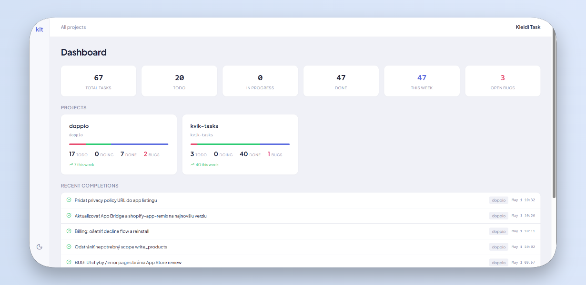

# KLEIDI task

[](https://go.dev)
[](LICENSE)
[](https://www.sqlite.org)
[](https://kleidi-task.pages.dev)

Local-first, single-binary task tracker for developers who use AI assistants. Built with MCP-first design — the AI integration is a primary interface, not an afterthought.



## Why kleidi-task?

Existing task managers are designed for humans clicking buttons. kleidi-task is designed for developers who work alongside AI assistants like Claude, Cursor, and Copilot. Tasks live with your project (per-project SQLite), sync across AI sessions via MCP, and everything runs locally — no cloud, no vendor lock-in.

## Features

**Core**
- Single Go binary, no external dependencies
- Per-project SQLite databases with global registry
- CLI, REST API, Web UI, and MCP server — all sharing one service layer

**Task Management**
- Task types: task, bug, feature, hotfix, plus custom types
- Full-text search (FTS5)
- Categories, priorities, bulk operations
- Task templates per type, enforced on create
- Split a large task into ordered, PR-sized child tasks
- Export/import as JSON or Markdown

**AI Integration**
- MCP server (stdio) for Claude Desktop, Cursor, VS Code — 24 tools
- Task workflows with phase-based AI prompts
- Spec-first task descriptions: templates the agent must fill, an `## Open questions`
  section for unresolved decisions, and a review pass that reports gaps before
  implementation starts
- Workflow phases that must record their outcome in the task before advancing
- Source code scanning for TODO/FIXME/HACK comments
- Claude skill with auto-parse title prefixes

**Web UI**
- Dashboard with project overview and stats
- Kanban board with drag-and-drop
- Vim-like keyboard shortcuts
- Markdown editor for descriptions
- Workflow editor with trigger configuration

**Infrastructure**
- Docker deployment with compose
- HTTP Basic Auth for teams
- Script hooks on task lifecycle events
- Git commit to task linking
- VS Code extension with task sidebar

## Installation

### Go install

```bash
go install github.com/tomas-chudjak/kleidi-task/cmd/klt@latest
```

### Build from source

```bash
git clone https://github.com/tomas-chudjak/kleidi-task.git
cd kleidi-task
task setup    # installs templ, sqlc, goose, air
task build    # builds the klt binary
task install  # symlinks to /usr/local/bin
```

Requires Go 1.25+.

### Docker

```bash
git clone https://github.com/tomas-chudjak/kleidi-task.git
cd kleidi-task
docker compose up -d
```

Web UI available at http://localhost:7842. See [docs/docker.md](docs/docker.md) for details.

## Quick start

```bash
# Initialize a project
cd my-project
klt init

# Add tasks
klt add "Implement user authentication"
klt add "BUG: Login fails on Firefox"        # auto-detected as bug
klt add --feature "Dark mode support"

# View tasks
klt list
klt list --status todo --type bug

# Work on tasks
klt done 1

# Start web UI
klt serve
# Open http://localhost:7842
```

## Spec-first task flow

A task description is a spec that accumulates, not text written once at creation.
kleidi-task enforces that rather than trusting the AI to remember:

```bash
# 1. A task is created from its type's template — every section must be filled.
#    With strict enforcement, an MCP or API create that skips the template is
#    rejected with the list of missing headings.
klt config set template_enforcement strict

# 2. Before implementation, review the spec for gaps and conflicts.
#    Reports missing and empty sections; writes nothing — you accept the findings.
klt review 42

# 3. Work advances through workflow phases. A phase can be required to record
#    its outcome in the description (feature research -> "## Design"), and
#    advancing is blocked while that section is empty.
klt advance 42

# 4. Large work is split into ordered, PR-sized children rather than one task.
#    A parent cannot be completed while any child is open.
klt split 42 "Schema and migration" "Service layer" "MCP and CLI wiring"
```

Anything the AI cannot answer from context lands under `## Open questions` in the
task instead of becoming a silent assumption. Templates also carry **agent rules** —
instructions handed to the AI filling them, never written into the task itself.

Modes are per project: `off`, `warn` (default — logs, still creates) and `strict`.
The CLI and web UI are never blocked; a human typing is not skipping the flow.

## MCP setup

Add kleidi-task as an MCP server in your AI tool:

### Claude Desktop

Add to `~/.claude/claude_desktop_config.json`:

```json
{
  "mcpServers": {
    "kleidi-task": {
      "command": "klt",
      "args": ["mcp"]
    }
  }
}
```

### Claude Code

```bash
claude mcp add --scope project --transport stdio kleidi-task -- klt mcp
```

### Cursor

Add to `.cursor/mcp.json`:

```json
{
  "mcpServers": {
    "kleidi-task": {
      "command": "klt",
      "args": ["mcp"]
    }
  }
}
```

Once connected, try: "task: implement search feature" or "show my tasks".

See [docs/mcp-usage.md](docs/mcp-usage.md) for the full MCP tool reference.

## CLI reference

| Command | Description |
|---------|-------------|
| `klt init` | Initialize `.tasks/` in current directory |
| `klt add <title>` | Create a task (`--bug`, `--feature`, `--hotfix`, or prefix detection) |
| `klt list` | List tasks (`--status`, `--type` filters) |
| `klt show <id>` | Show task detail |
| `klt done <id>` | Mark task as complete |
| `klt update <id>` | Update task fields |
| `klt delete <id>` | Delete a task |
| `klt split <id> <title>...` | Split a task into ordered child tasks |
| `klt review <id>` | Review a description for gaps, conflicts and unmade decisions |
| `klt advance <id>` | Advance task to next workflow phase |
| `klt archive <id>` | Archive a completed task |
| `klt unarchive <id>` | Restore an archived task back to done |
| `klt suggest` | Scan source code for TODO/FIXME comments |
| `klt export` | Export tasks as JSON or Markdown |
| `klt import <file>` | Import tasks from file |
| `klt serve` | Start HTTP server (UI + API) |
| `klt mcp` | Start MCP stdio server |
| `klt setup` | Install or update the Claude Code skills for this project |
| `klt config get\|set` | View or change project configuration |
| `klt project list\|stats` | Manage registered projects |
| `klt user add <name>` | Add a user (enables Basic Auth) |
| `klt backup` | Backup project database |
| `klt version` | Show version |

See [docs/cli.md](docs/cli.md) for all flags and examples.

## How it works

```
You (CLI / Browser / Claude)
    |
  klt binary
    |
  Service Layer (TaskService, ProjectService, WorkflowService, TemplateService, ...)
    |
  SQLite
    |-- ~/.tasks/registry.db      (global project registry + users)
    '-- <project>/.tasks/tasks.db (per-project tasks)
```

Each project gets its own SQLite database in `.tasks/`. A global registry at `~/.tasks/registry.db` maps project slugs to paths.

## Documentation

| Document | Description |
|----------|-------------|
| [Installation](docs/installation.md) | Install and build guide |
| [CLI Reference](docs/cli.md) | All commands, flags, and examples |
| [REST API](docs/rest-api.md) | API endpoints and curl examples |
| [MCP Integration](docs/mcp-usage.md) | MCP tools and AI assistant setup |
| [Configuration](docs/configuration.md) | Global and project config options |
| [Workflows](docs/workflows.md) | Phase-based task workflows |
| [Authentication](docs/authentication.md) | HTTP Basic Auth for teams |
| [Docker](docs/docker.md) | Container deployment |
| [Script Hooks](docs/hooks.md) | Task lifecycle event hooks |
| [Git Integration](docs/git-integration.md) | Commit to task linking |
| [VS Code Extension](docs/vscode-extension.md) | Task sidebar for VS Code/Cursor |

## Tech stack

Go, SQLite (modernc.org/sqlite), sqlc, chi, cobra, HTMX, templ, ahoylog-css, MCP Go SDK, SortableJS.

## License

MIT
